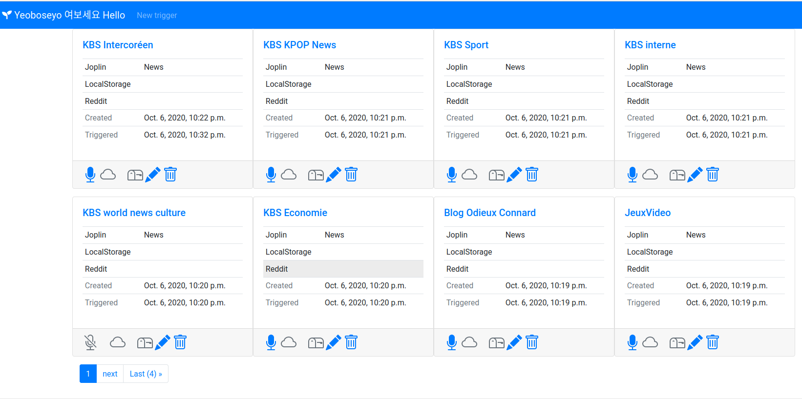
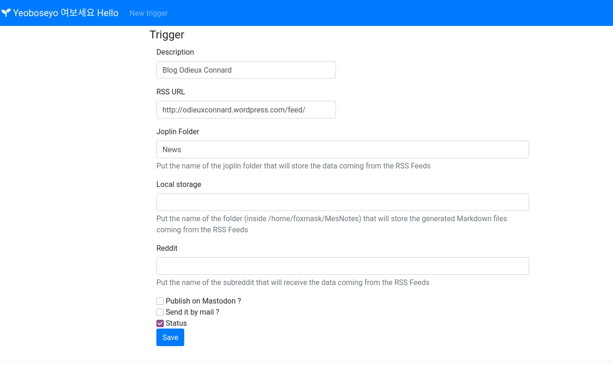
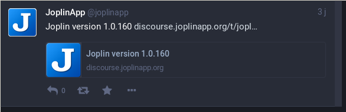

# 여보세요

let's the services say "hello" (여보세요 in Korean : `yeoboseyo`) to each others

This `hello` can be any data you want to get and send from any internet service to another



Services covered:

- [Joplin markdown editor](https://joplinapp.org)
- RSS Feeds
- [Mastodon](https://mastodon.social)
- [Reddit](https://reddit.com)

So today, you can grab RSS Feeds and this will:
* create notes in Joplin automatically in the folder you defined in the form
* post "toot" to your mastodon account
* post stuff to the subreddit of your choice
* be stored on the local filesytem in Markdown file format

## :package: Installation

### pre requisistes

- python 3.8
- Django (the web application)
- ([for Starlette instead of Django, same project here](https://github.com/foxmask/yeoboseyo))
- feedparser (for RSS support)
- mastodon.py (for Mastodon support)
- praw (for Reddit support)
- joplin-api (for Joplin support)
- pypandoc (to convert html to markdown)

### Installation
create a virtualenv

```bash
python3 -m venv yeoboseyo
cd yeoboseyo
source bin/activate
pip install -r requirements.txt
```

##  :wrench: Settings
```bash
mv env.sample .env
```
set the correct values for your own environment
```ini
DATABASE_URL=sqlite:///db.sqlite3
TIME_ZONE=Europe/Paris
JOPLIN_URL=http://127.0.0.1
JOPLIN_PORT=41184
JOPLIN_TOKEN=  # put the token you can find in the webclipper page of joplin editor
FORMAT_FROM=markdown_github
FORMAT_TO=html
BYPASS_BOZO=False   # if you don't want to get the malformed RSS Feeds set it to False
LOG_LEVEL=logging.INFO
MASTODON_USERNAME=  # your mastodon username
MASTODON_PASSWORD=  # your mastodon password
MASTODON_INSTANCE=https://mastodon.social  # your mastodon instance
REDDIT_CLIENT_ID=   # see below explanation
REDDIT_CLIENT_SECRET= # see below explanation
REDDIT_PASSWORD=   # put your reddit password
REDDIT_USERAGENT=Yeoboseyo/1.0   # whatever :P
REDDIT_USERNAME=  #put your reddit login
```

## :dvd: Database

create the database (to execute only once)
```bash
python models.py
```

##  :shell: Mastodon Service
once your settings are ready run the following commands once

```bash
python mastodon_create_app.py
```
this will create an app named 'Yeoboseyo' with the username/pass you provided in the `.env` setting file .

this command will also create a file named `yeoboseyo_clientcred.secret` containing the token allowing us to publish stuff automatically.

##  :shell: Reddit service

you will need to declare an app from this page [https://www.reddit.com/prefs/apps](https://www.reddit.com/prefs/apps)

* enter th name of your app (eg "Yeoboseyo")
* select 'script'
* fill a description (eg "The bus for your internet services - an opensource alternative to IFTTT.com")
* about url : http://localhost
* redirect url : http://localhost/callback
then press create ; once it's done
in the frame you see the name "Yeoboseyo" under it "personal use script" and under it ; the precious REDDIT_CLIENT_ID, then the REDDIT_CLIENT_SECRET
Use those info to fill the `.env` file

## :mega: Running the Web application

start the application
```bash
cd yeoboseyo
python app.py &
여보세요 !
INFO: Started server process [13588]
INFO: Waiting for application startup.
INFO: Uvicorn running on http://0.0.0.0:8000 (Press CTRL+C to quit)
```


### :eyes: Adding some Feeds to track

Go on http://0.0.0.0:8000 and fill the form to add new Feeds to track

* If you plan to publish RSS Feeds into a joplin note, fill the "Joplin folder" field, if not leave it empty.
* If you plan to publish RSS Feeds on your Mastodon account, check the checkbox "Publish on Mastodon?", if not, leave it unchecked

#### Yeoboseyo form



###  :dizzy: Running the engine

now that you fill settings, and form, launch the command and see how many feeds are comming
```bash
./manage.py run.py
```
to see how are set your feeds enter
```bash
./manage.py report
$ ./manage.py report
┏━━━━┳━━━━━━━━━━━━━━━━━━━━━━━━┳━━━━━━━━━━━━━━━━━┳━━━━━━━━━━━━━━━┳━━━━━━━━━━┳━━━━━━━━━━┳━━━━━━━━┳━━━━━━━━┳━━━━━━━━━━━━━━━━━━━━━━━━━━━━━━━━━━┓
┃ ID ┃ Name                   ┃ Md Folder       ┃ Joplin Folder ┃ Mastodon ┃ Mail     ┃ Reddit ┃ Status ┃ Triggered                        ┃
┡━━━━╇━━━━━━━━━━━━━━━━━━━━━━━━╇━━━━━━━━━━━━━━━━━╇━━━━━━━━━━━━━━━╇━━━━━━━━━━╇━━━━━━━━━━╇━━━━━━━━╇━━━━━━━━╇━━━━━━━━━━━━━━━━━━━━━━━━━━━━━━━━━━┩
│ 1  │ KBS World news science │ ***Not used *** │ News          │ Ok       │ Disabled │        │ Ok     │ 2020-10-06 13:05:40.452455+00:00 │
│ 2  │ KBS World news showbiz │ ***Not used *** │ News          │ Ok       │ Disabled │        │ Ok     │ 2020-10-06 13:05:41.615231+00:00 │
└────┴────────────────────────┴─────────────────┴───────────────┴──────────┴──────────┴────────┴────────┴──────────────────────────────────┘

```
to switch the publishing by mail 
```bash
$ ./manage.py switch_mail 1
Successfully enabled Mail Trigger 'KBS World news science'
(yeoboseyo-django) ✔ ~/Projects/yeoboseyo-django/yeoboseyo-django [master|✚ 6] 
16:11 $ ./manage.py report
┏━━━━┳━━━━━━━━━━━━━━━━━━━━━━━━┳━━━━━━━━━━━━━━━━━┳━━━━━━━━━━━━━━━┳━━━━━━━━━━┳━━━━━━━━━━┳━━━━━━━━┳━━━━━━━━┳━━━━━━━━━━━━━━━━━━━━━━━━━━━━━━━━━━┓
┃ ID ┃ Name                   ┃ Md Folder       ┃ Joplin Folder ┃ Mastodon ┃ Mail     ┃ Reddit ┃ Status ┃ Triggered                        ┃
┡━━━━╇━━━━━━━━━━━━━━━━━━━━━━━━╇━━━━━━━━━━━━━━━━━╇━━━━━━━━━━━━━━━╇━━━━━━━━━━╇━━━━━━━━━━╇━━━━━━━━╇━━━━━━━━╇━━━━━━━━━━━━━━━━━━━━━━━━━━━━━━━━━━┩
│ 1  │ KBS World news science │ ***Not used *** │ News          │ Disabled │ Ok       │        │ Ok     │ 2020-10-06 14:11:48.977241+00:00 │
│ 2  │ KBS World news showbiz │ ***Not used *** │ News          │ Ok       │ Disabled │        │ Ok     │ 2020-10-06 13:05:41.615231+00:00 │
└────┴────────────────────────┴─────────────────┴───────────────┴──────────┴──────────┴────────┴────────┴──────────────────────────────────┘
```
to switch the publishing on mastodon
```bash
$ ./manage.py switch_masto 1
Successfully disabled Mastodon Trigger 'KBS World news science'
(yeoboseyo-django) ✔ ~/Projects/yeoboseyo-django/yeoboseyo-django [master|✚ 6] 
16:10 $ ./manage.py report
┏━━━━┳━━━━━━━━━━━━━━━━━━━━━━━━┳━━━━━━━━━━━━━━━━━┳━━━━━━━━━━━━━━━┳━━━━━━━━━━┳━━━━━━━━━━┳━━━━━━━━┳━━━━━━━━┳━━━━━━━━━━━━━━━━━━━━━━━━━━━━━━━━━━┓
┃ ID ┃ Name                   ┃ Md Folder       ┃ Joplin Folder ┃ Mastodon ┃ Mail     ┃ Reddit ┃ Status ┃ Triggered                        ┃
┡━━━━╇━━━━━━━━━━━━━━━━━━━━━━━━╇━━━━━━━━━━━━━━━━━╇━━━━━━━━━━━━━━━╇━━━━━━━━━━╇━━━━━━━━━━╇━━━━━━━━╇━━━━━━━━╇━━━━━━━━━━━━━━━━━━━━━━━━━━━━━━━━━━┩
│ 1  │ KBS World news science │ ***Not used *** │ News          │ Disabled │ Disabled │        │ Ok     │ 2020-10-06 14:10:54.943481+00:00 │
│ 2  │ KBS World news showbiz │ ***Not used *** │ News          │ Ok       │ Disabled │        │ Ok     │ 2020-10-06 13:05:41.615231+00:00 │
└────┴────────────────────────┴─────────────────┴───────────────┴──────────┴──────────┴────────┴────────┴──────────────────────────────────┘

```
to set on or off one feed
```bash
./manage.py switch_status 1
Successfully disabled Trigger 'KBS World news science'
(yeoboseyo-django) ✔ ~/Projects/yeoboseyo-django/yeoboseyo-django [master|✚ 6] 
16:12 $ ./manage.py report
┏━━━━┳━━━━━━━━━━━━━━━━━━━━━━━━┳━━━━━━━━━━━━━━━━━┳━━━━━━━━━━━━━━━┳━━━━━━━━━━┳━━━━━━━━━━┳━━━━━━━━┳━━━━━━━━━━┳━━━━━━━━━━━━━━━━━━━━━━━━━━━━━━━━━━┓
┃ ID ┃ Name                   ┃ Md Folder       ┃ Joplin Folder ┃ Mastodon ┃ Mail     ┃ Reddit ┃ Status   ┃ Triggered                        ┃
┡━━━━╇━━━━━━━━━━━━━━━━━━━━━━━━╇━━━━━━━━━━━━━━━━━╇━━━━━━━━━━━━━━━╇━━━━━━━━━━╇━━━━━━━━━━╇━━━━━━━━╇━━━━━━━━━━╇━━━━━━━━━━━━━━━━━━━━━━━━━━━━━━━━━━┩
│ 1  │ KBS World news science │ ***Not used *** │ News          │ Disabled │ Ok       │        │ Disabled │ 2020-10-06 14:12:29.370273+00:00 │
│ 2  │ KBS World news showbiz │ ***Not used *** │ News          │ Ok       │ Disabled │        │ Ok       │ 2020-10-06 13:05:41.615231+00:00 │
└────┴────────────────────────┴─────────────────┴───────────────┴──────────┴──────────┴────────┴──────────┴──────────────────────────────────┘
```
and finally run ;)
```
 $ ./manage.py run
여보세요 !
Trigger KBS World news showbiz : no feeds read
```

RSS Source


Publication on Mastodon


